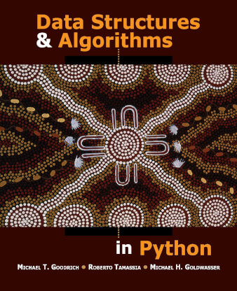
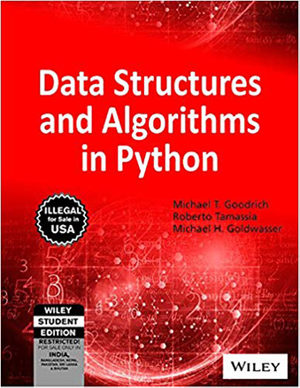
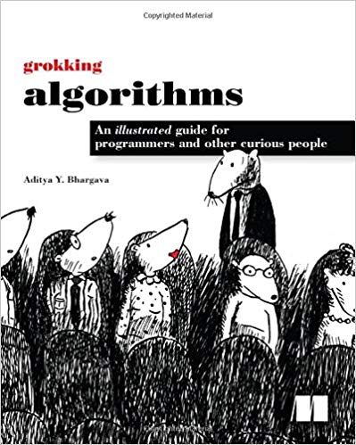

# Code Catalog in Python

**This is my catalog of data structures and algorithms for review for a coding 
interview.**

I've printed these out and so I can review them.

It's probably not necessary to memorize them, just know the concepts and how 
they work in case you need to recreate them in an interview.

This is really just for me, but I wanted to share. I'll likely add more, but 
they will all be in Python.

For great books on data structures and algorithms in Python:

- [Data Structures and Algorithms in Python (hardcover)](https://www.amazon.com/Structures-Algorithms-Python-Michael-Goodrich/dp/1118290275)
- [Data Structures and Algorithms in Python (paperback - much cheaper)](https://www.amazon.com/Structures-Algorithms-Python-Michael-Goodrich/dp/812656217X/)

- [Grokking Algorithms](https://www.amazon.com/Grokking-Algorithms-illustrated-programmers-curious/dp/1617292230/)

---

May contain bugs.
